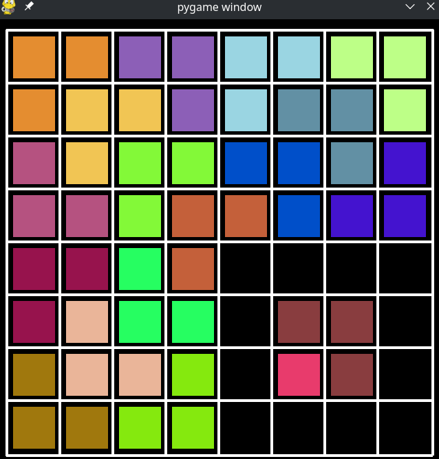

# Tiling Problem (Problema de Adoquinamiento)

## Descripcion
Dada una cuadricula de $m \times m$, donde $m$ es de la forma $2^k$, $k \geq 1$. En la cuadricula existe un *cuadro especial* que se coloca de manera arbitraria y no podra ser cubierto por ninguna otra pieza en forma de *L*. 



## Requerimientos

Es necesario tener instalada la version 2.7.18 de pyhton
```
sudo apt-add-repository universe

sudo apt update

sudo apt install python2-minimal
```
  
Igualmente, se necesita instalar las bibliotecas de pyhton (`pygame` y `numpy`)
``` 
sudo apt-get install python-pip 

pip2 install numpy pygame
```


## Uso

```
python main.py <tamanio de la cuadricula>
```

